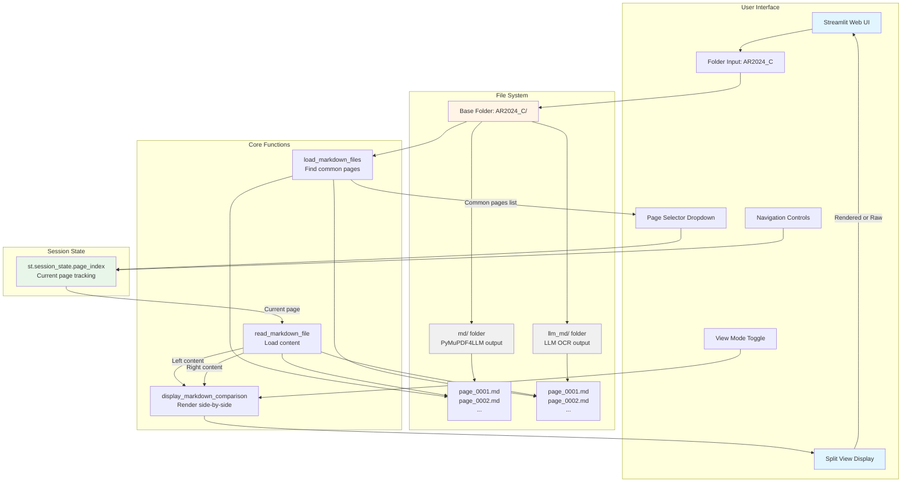

# OCR Sample Project

A comparison toolkit for evaluating different OCR/text extraction approaches on PDF documents, featuring traditional PDF parsing vs. LLM-based vision OCR.

## Overview

This project demonstrates and compares two approaches for extracting text from PDF documents:

1. **Traditional PDF Parsing** - Using PyMuPDF4LLM for direct text/layout extraction
2. **LLM Vision OCR** - Using vision-capable language models (Google Gemini) to perform OCR on rendered PDF pages

## Features

### 📄 PDF Processing (`main.py`)

Comprehensive PDF processing utility with multiple modes:

- Convert entire PDFs to markdown using PyMuPDF4LLM
- Export specific page ranges as both markdown and PNG images
- Generate grayscale, contrast-enhanced images optimized for VLM processing
- Batch process multiple PDFs from a directory

**Example Usage:**
```bash
# Export pages 1-5 from a PDF (markdown + PNG + grayscale)
uv run main.py --export-pages document.pdf --range 1-5

# Export all pages at high resolution
uv run main.py --export-pages document.pdf --range all --dpi 300

# Extract markdown from entire PDF
uv run main.py document.pdf
```

### 🤖 LLM-Based OCR (`llm_ocr.py`)

Vision-based text extraction using pydantic-ai and OpenRouter:

- Two-stage pipeline: initial OCR + refinement pass
- Uses Google Gemini 2.5 Flash models
- Integrated with Langfuse for monitoring and observability
- Processes entire folders of images in batch

**Example Usage:**
```bash
# Process all images in a folder
uv run llm_ocr.py AR2024_C/png_bw/

# Output saved to: AR2024_C/llm_md/
```

### 📊 Comparison Dashboard (`compare_md.py`)

Interactive Streamlit app for side-by-side markdown comparison:

- Compare PyMuPDF4LLM vs LLM OCR outputs
- Navigate between pages with controls
- Toggle between rendered and raw markdown views
- Character count statistics

**Example Usage:**
```bash
uv run streamlit run compare_md.py
```

**Architecture:**



### 🧪 Agent Demo (`agent.py`)

Example pydantic-ai agent implementation featuring:

- Multi-tool agent (calculator + lottery result extractor)
- Agent delegation pattern for vision tasks
- Structured output with Pydantic models

## Tech Stack

- **PyMuPDF / PyMuPDF4LLM** - Traditional PDF text extraction
- **pydantic-ai** - LLM agent framework with structured outputs
- **OpenRouter** - Access to Google Gemini vision models
- **Langfuse** - LLM observability and monitoring
- **Streamlit** - Interactive comparison dashboard
- **uv** - Fast Python package and project manager

## Setup

1. Install dependencies:
```bash
uv sync
```

2. Configure environment variables (create `.env` file):
```env
OPENROUTER_API_KEY=your_key_here
LANGFUSE_PUBLIC_KEY=your_key_here
LANGFUSE_SECRET_KEY=your_key_here
LANGFUSE_HOST=https://cloud.langfuse.com
```

## Typical Workflow

1. **Prepare PDF pages**:
   ```bash
   uv run main.py --export-pages AR2024_C.pdf --range 1-10
   ```
   Creates: `AR2024_C/md/`, `AR2024_C/png/`, `AR2024_C/png_bw/`

2. **Run LLM OCR**:
   ```bash
   uv run llm_ocr.py AR2024_C/png_bw/
   ```
   Creates: `AR2024_C/llm_md/`

3. **Compare results**:
   ```bash
   uv run streamlit run compare_md.py
   ```
   Opens interactive dashboard at `http://localhost:8501`

## Project Structure

```
.
├── main.py          # PDF processing utilities
├── llm_ocr.py       # LLM-based vision OCR
├── compare_md.py    # Streamlit comparison dashboard
├── agent.py         # pydantic-ai agent examples
├── pyproject.toml   # uv project configuration
└── AR2024_C.pdf     # Sample PDF for testing
```
